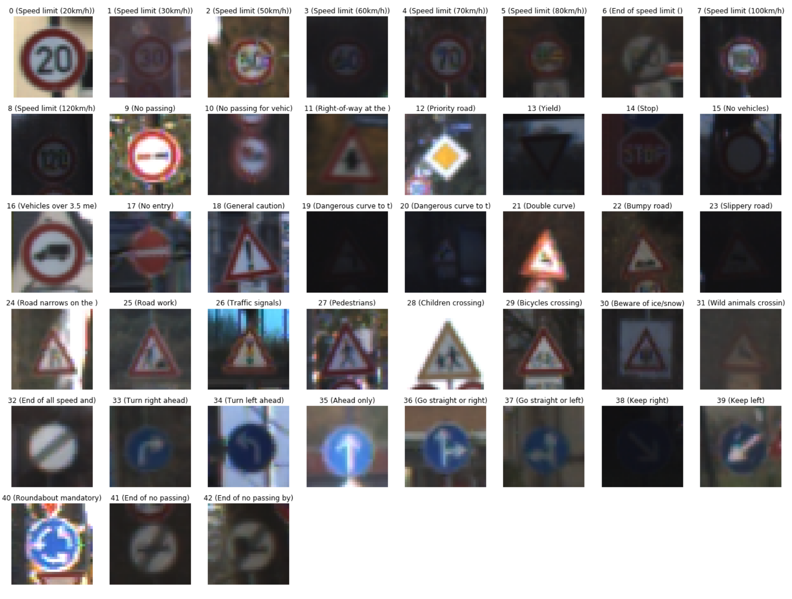
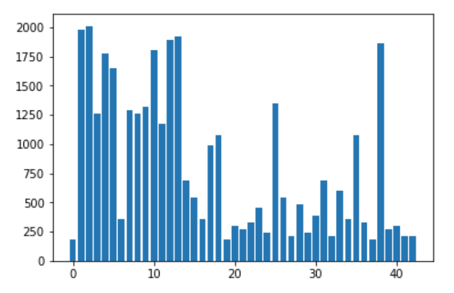
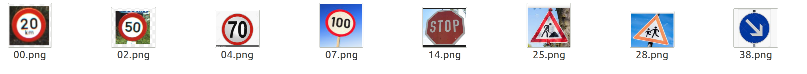
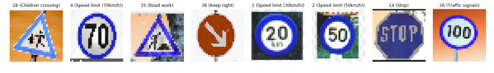
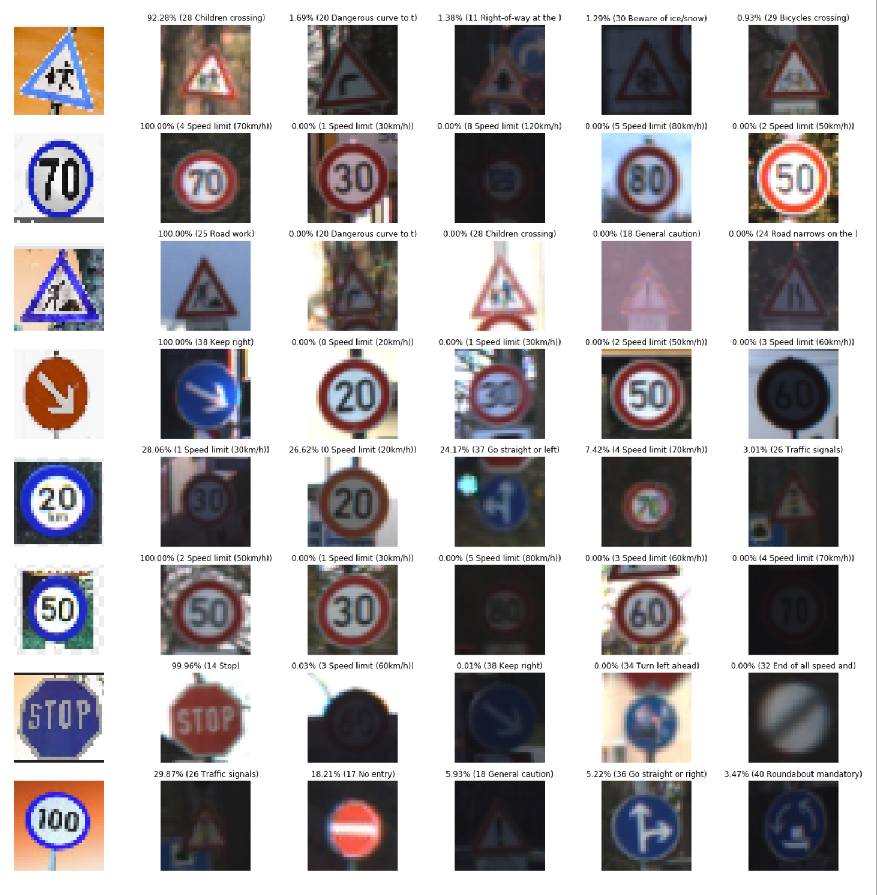
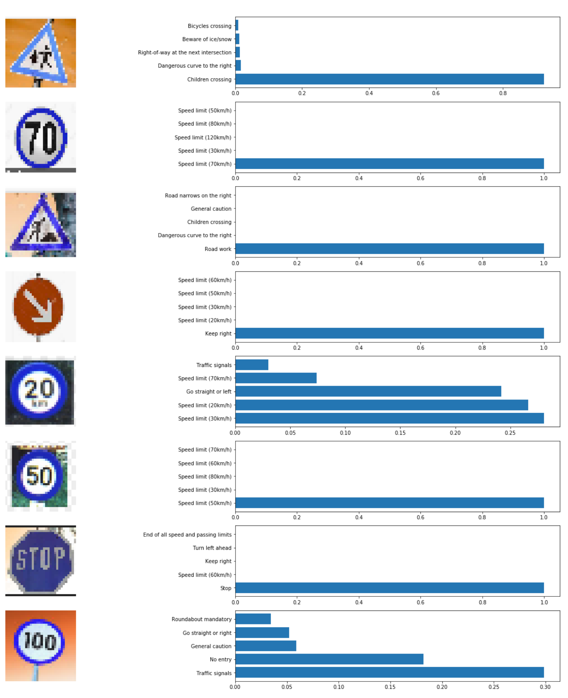

## Traffic sign detector using TensorFlow
[](http://www.udacity.com/drive) 

------

The following project is a part of Udacity’s Self Driving car engineering NanoDegree program. The aim of project is to successfully classify traffic sign from German Traffic sign dataset having 43 classes.

------

The Project
---

The steps of this project are the following:

* Dataset is downloaded automatically.
* Dataset is converted into the python friendly format.
* Preprocessing the data
* Designing a neural network architecture in TensorFlow.
* Training and testing the Network on the dataset.
* Testing the network on random images.
* Showing the Top 5 Softmax Probabilities For Each Image Found on the Web.

------

## Prerequisites

- Pip 
- Python 3
- Virtual Environment

## Install instructions

`open terminal`

```bash
$ git clone https://github.com/Shivam-Bhardwaj/TrafficSignDetector-TensorFlow.git
$ virtualenv --no-site-packages -p python3 venv 
$ source venv/bin/activate
$ cd TrafficSignDetector-TensorFlow
$ pip install -r requirements.txt
$ jupyter notebook
```

`open Traffic_Sign_Classifier.ipnyb`

------

## Downloading dataset

**You don't have to think about the dataset. My code does everything for you :)** 

The code under `Step 0: Load The Data` does the following:

1. Download the dataset in an external folder.

2. Unzip the dataset.

3. Delete the original Zip file as it is no longer required.

4. Load the data in Pickle format.

5. Save the data in 

   ```python
   X_train, y_train # For training data and labels
   X_valid, y_valid # For validation data and labels
   X_test, y_test # For Final test data and labels
   ```

------

## [Rubric](https://review.udacity.com/#!/rubrics/571/view) Points

#### Here I will consider the rubric points individually and describe how I addressed each point in my implementation.  

------

### Writeup / README

#### 1. Provide a Writeup / README that includes all the rubric points and how you addressed each one.    

The given README.md file is an extensive writeup of the project. For any questions, please contact 

Shivam Bhardwaj 

 [LinkedIn](<https://www.linkedin.com/in/shivamnyu/>) [Instagram](https://www.instagram.com/lazy.shivam/) [Facebook](<https://www.facebook.com/shivambhardwaj2008>) [Github](https://github.com/Shivam-Bhardwaj)

Mail to shivam.bhardwaj@nyu.edu

------

### Data Set Summary & Exploration

As explained in the code I used the pandas library to calculate summary statistics of the traffic
signs data set:

- The size of training set is 34799 images
- The size of the validation set is 4410 images
- The size of test set is 12630
- The shape of a traffic sign image is (32, 32, 3)
- The number of unique classes/labels in the data set is 43

**The following table as all the sign names with their corresponding ClassID**

| ClassId | SignName                                           |
| ------- | -------------------------------------------------- |
| 0       | Speed limit (20km/h)                               |
| 1       | Speed limit (30km/h)                               |
| 2       | Speed limit (50km/h)                               |
| 3       | Speed limit (60km/h)                               |
| 4       | Speed limit (70km/h)                               |
| 5       | Speed limit (80km/h)                               |
| 6       | End of speed limit (80km/h)                        |
| 7       | Speed limit (100km/h)                              |
| 8       | Speed limit (120km/h)                              |
| 9       | No passing                                         |
| 10      | No passing for vehicles over 3.5 metric tons       |
| 11      | Right-of-way at the next intersection              |
| 12      | Priority road                                      |
| 13      | Yield                                              |
| 14      | Stop                                               |
| 15      | No vehicles                                        |
| 16      | Vehicles over 3.5 metric tons prohibited           |
| 17      | No entry                                           |
| 18      | General caution                                    |
| 19      | Dangerous curve to the left                        |
| 20      | Dangerous curve to the right                       |
| 21      | Double curve                                       |
| 22      | Bumpy road                                         |
| 23      | Slippery road                                      |
| 24      | Road narrows on the right                          |
| 25      | Road work                                          |
| 26      | Traffic signals                                    |
| 27      | Pedestrians                                        |
| 28      | Children crossing                                  |
| 29      | Bicycles crossing                                  |
| 30      | Beware of ice/snow                                 |
| 31      | Wild animals crossing                              |
| 32      | End of all speed and passing limits                |
| 33      | Turn right ahead                                   |
| 34      | Turn left ahead                                    |
| 35      | Ahead only                                         |
| 36      | Go straight or right                               |
| 37      | Go straight or left                                |
| 38      | Keep right                                         |
| 39      | Keep left                                          |
| 40      | Roundabout mandatory                               |
| 41      | End of no passing                                  |
| 42      | End of no passing by vehicles over 3.5 metric tons |

**The following image corresponds to images of one sign per ClassId**



**The following image is the distribution of number of images per class**



#### 2. Describe what your final model architecture looks like including model type, layers, layer sizes, connectivity, etc.) Consider including a diagram and/or table describing the final model.

The visual representation of my model is shown below:

.svg)

My final model consisted of the following layers:

|      Layer      |                 Description                 |
| :-------------: | :-----------------------------------------: |
|      Input      |              32x32x3 RGB image              |
| Convolution 3x3 | 1x1 stride, valid padding, outputs 30x30x15 |
|      RELU       |                      -                      |
|   Max pooling   |        2x2 stride,  outputs 15@15x15        |
| Convolution 3x3 | 1x1 stride, valid padding, outputs 30@13x13 |
|      RELU       |                      -                      |
|   Max pooling   |         2x2 stride,  outputs 30@6x6         |
| Fully Connected |                    1080                     |
| Fully Connected |                     500                     |
| Fully Connected |                     280                     |
| Fully Connected |                     110                     |
| Fully Connected |                     42                      |

#### 3. Describe how you trained your model. The discussion can include the type of optimizer, the batch size, number of epochs and any hyper-parameters such as learning rate.

To train the model, I used 

```python
RATE = 0.003
EPOCHS = 40
BATCH_SIZE = 512
DROPOUT = 0.5
```


#### 4. Include in the discussion the results on the training, validation and test sets and where in the code these were calculated. Your approach may have been an iterative process, in which case, outline the steps you took to get to the final solution and why you chose those steps. Perhaps your solution involved an already well known implementation or architecture. In this case, discuss why you think the architecture is suitable for the current problem.

My final model results were:

- training set accuracy of 99.9%
- validation set accuracy of 97.9% 
- test set accuracy of 96.4%

### Test a Model on New Images

#### 1. Choose five German traffic signs found on the web and provide them in the report. For each image, discuss what quality or qualities might be difficult to classify.

Here are few German traffic signs that I found on the web:



The above images are given that particular name as first two letter denotes the class of the image.

#### 2. Discuss the model's predictions on these new traffic signs and compare the results to predicting on the test set. At a minimum, discuss what the predictions were, the accuracy on these new predictions, and compare the accuracy to the accuracy on the test set (OPTIONAL: Discuss the results in more detail as described in the "Stand Out Suggestions" part of the rubric).

Here are the results of the prediction:



The model was able to correctly guess 6 of the 8 traffic signs, which gives an accuracy of 75%. 

#### 3. Describe how certain the model is when predicting on each of the five new images by looking at the softmax probabilities for each prediction. **The following image is the probability distribution of top 5 Soft-Max probability of every test image.**




### Testing parameters

The code was tested on the following specifications

- **CPU:** `Intel(R) Core(TM) i9-8950HK CPU @ 4.8 Ghz`
- **GPU:** `Nvidia GeForce GTX 1050 Ti Mobile`
- **OS:** `Ubuntu 16.04.6 LTS (Xenial Xerus)` 
- **Kernal:** `4.15.0-48-generic`

Training for 40 epochs takes  ~ 80 Sec

